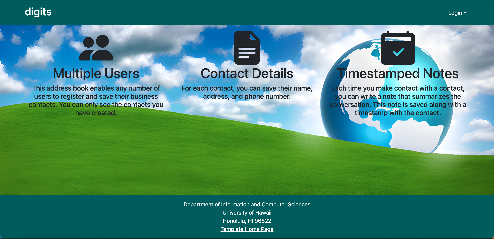
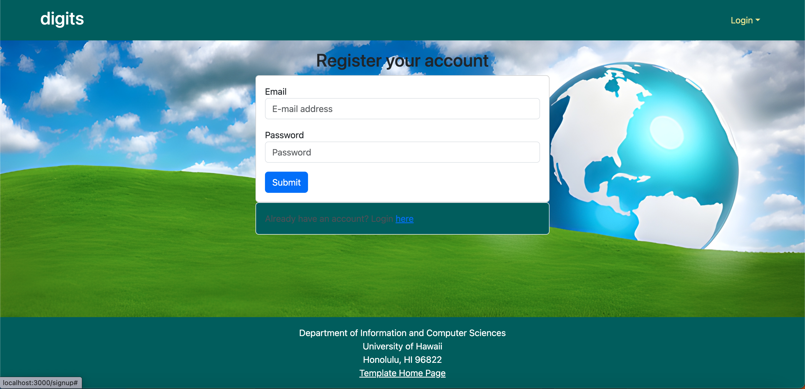
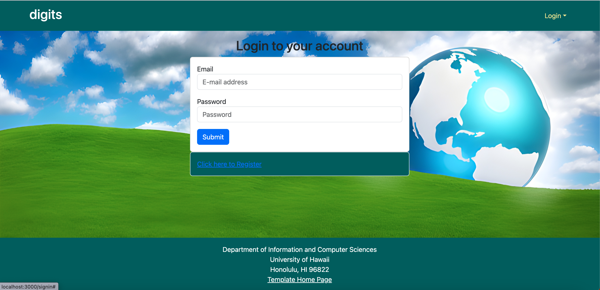
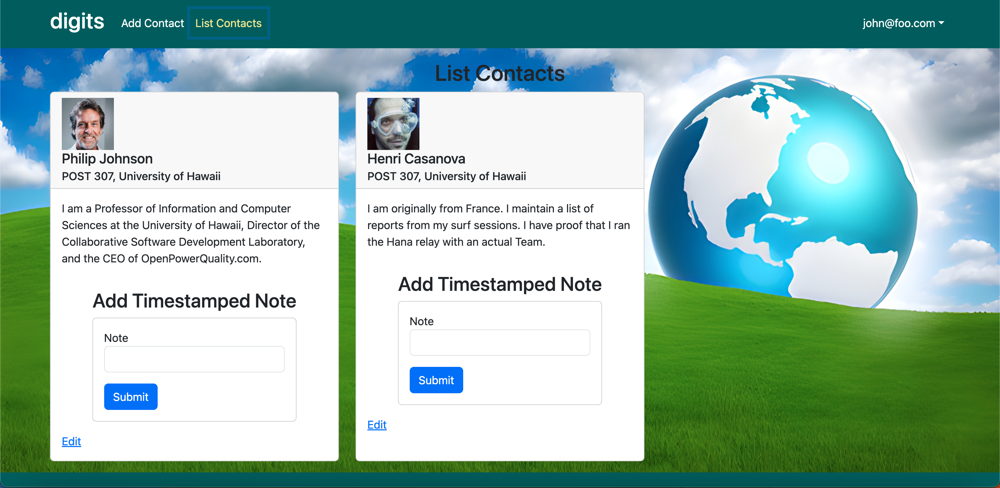
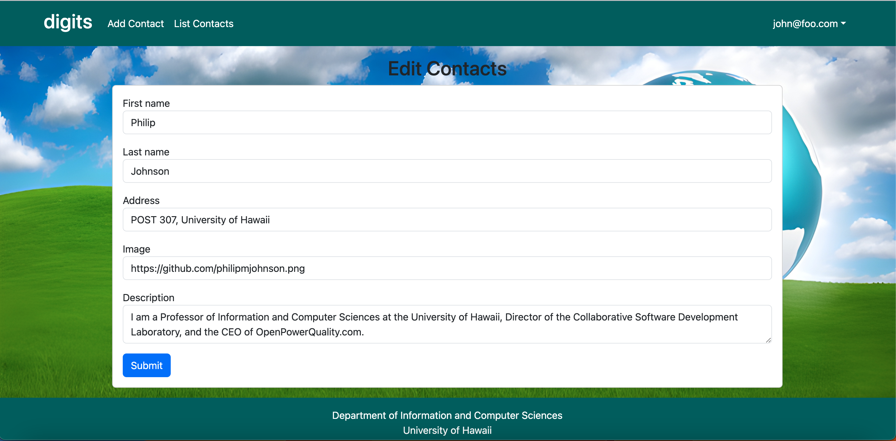
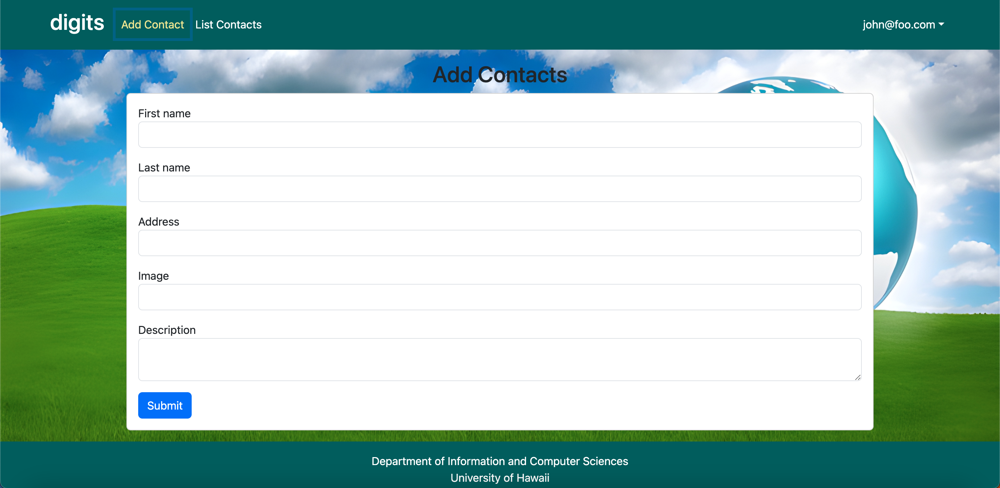
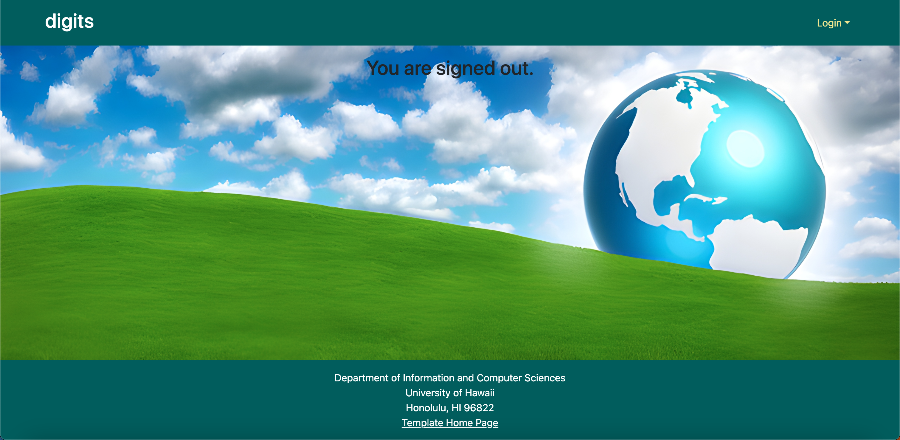

digits is a Meteor application that displays a list of contacts with pictures and information for each contact. Logged-in users can access the individual contacts associated with their account. Timestamped may also be added to each contact.

## Installation

1. Install Meteor.
2. Go to https://github.com/kimsyd/digits and clone the repo as your own repo.
3. cd into app/ directory and install third-party libraries with 
```
$meteor npm install 
```
4. Run the application by invoking
```
$meteor npm run start
```

## Walkthrough

### Landing


Upon running the app and visiting http://localhost:3000, this page will be displayed showcasing the features of digits. The upper right hand dropdown allows users to sign in or register a new user.

### New User Onboarding



Clicking Sign up allows a new user to create an account. 

### Existing User Signin



Alternatively, clicking Sign In results in this page allowing an existing user to log in.

### Logged-in Landing


After an existing user logs in, this landing page is displayed.

### List Contacts



Clicking List Contacts displays a list of contact people with descriptions. Notes can also be added directly from the List Contacts page.

### Edit Contacts



Clicking Edit displays a page where contact information can be changed.

### Add Contacts



Clicking Add Contact displays a field form where new contact information can be entered.

### Sign Out



Clicking the Sign Out option under the user's email address displays this page and signs the current user out.

